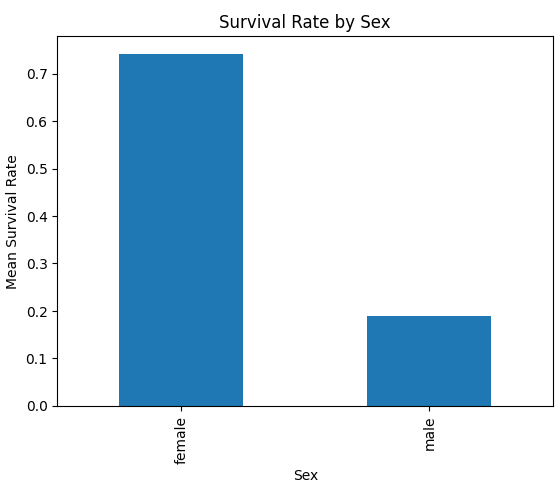
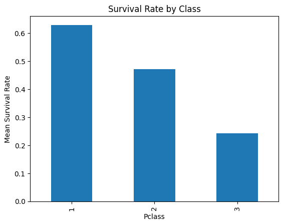
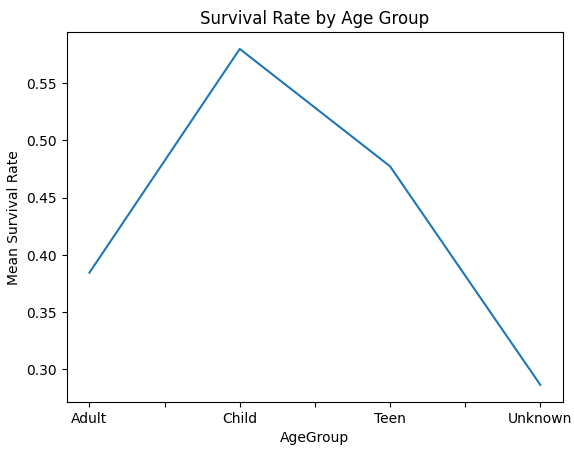
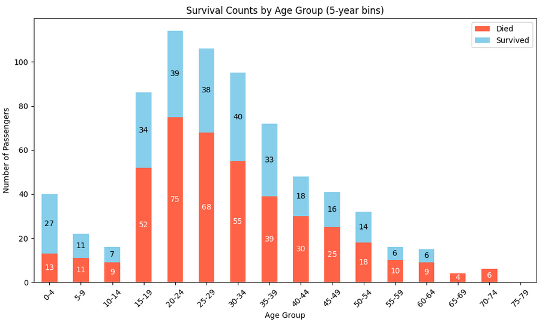
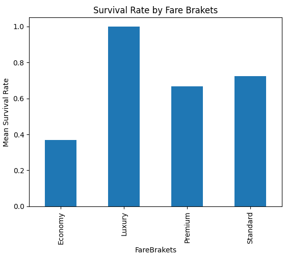
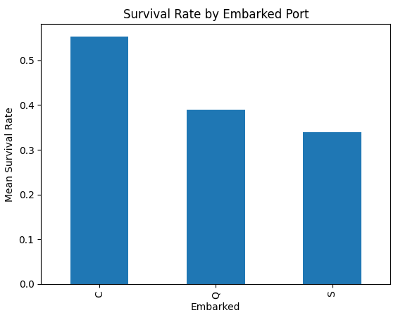
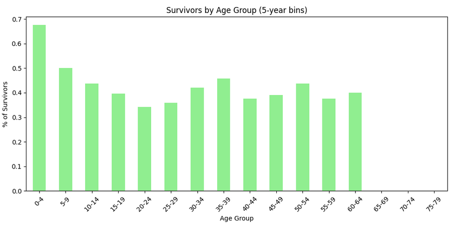
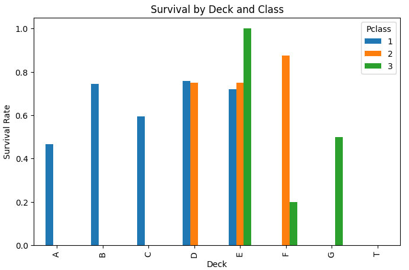

# Titanic - Data Analysis with Pandas

An exploratory data analysis of the famous Titanic dataset, created to practice and demonstrate data manipulation and visualization skills using the Pandas library in Python.

### 🎯 Project Goal

This project was developed as a practical exercise to deepen my knowledge in data analysis. The main focus was on using the **Pandas** library to perform data cleaning, processing, manipulation, and exploration, aiming to extract insights from the Titanic dataset.

### 📊 Dataset

The dataset used is "Titanic - Machine Learning from Disaster," one of the most well-known datasets on the Kaggle platform. It contains demographic and travel information for 891 passengers of the RMS Titanic.

* **Source:** [Kaggle - Titanic Dataset](https://www.kaggle.com/c/titanic/data)

### 🛠️ Tools & Technologies Used

The following tools and libraries were used in the development of this analysis:

* **Python**
* **Pandas**
* **Matplotlib / Seaborn**
* **Jupyter Notebook**

---

### ⚙️ Analysis and Findings

The exploratory analysis aimed to answer several questions about the Titanic passengers. The key findings are visualized in the charts below, generated from the data.

* **Survival Rate by Sex and Ticket Class:** The analysis shows clear disparities in survival based on gender and the passenger's ticket class.

    
    

* **Survival Rate by Age and Fare:** Age was a critical factor, with different survival rates across various age groups. Similarly, the fare paid for the ticket also correlated with survival chances.

    
    
    

* **Survival Rate by Port of Embarkation:** The port where passengers embarked also shows a correlation with their survival rate.

    

* **Other Insights:**

    
    

---

### Author
**Pedro Mota**
* [GitHub](https://github.com/PMota173)
* [LinkedIn](https://www.linkedin.com/in/pedro-mota173/)
